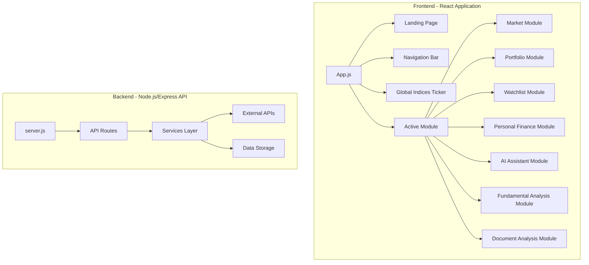

# 📊 INFORME INTEGRAL - BLOOMBERG TERMINAL AI
## Software Requirements Specification (SRS) & Análisis Técnico Completo

---

## 📋 TABLA DE CONTENIDOS

1. [Resumen Ejecutivo](#resumen-ejecutivo)
2. [Arquitectura del Sistema](#arquitectura-del-sistema)
3. [Componentes del Sistema](#componentes-del-sistema)
4. [Proveedores y APIs Externas](#proveedores-y-apis-externas)
5. [Estado Actual del Sistema](#estado-actual-del-sistema)
6. [Análisis de Código](#análisis-de-código)
7. [Problemas Identificados](#problemas-identificados)
8. [Recomendaciones](#recomendaciones)
9. [Plan de Acción](#plan-de-acción)

---

## 🎯 RESUMEN EJECUTIVO

### Descripción del Proyecto
Bloomberg Terminal AI es una réplica profesional y gratuita del famoso Bloomberg Terminal, construida con tecnología moderna (React + Node.js) que proporciona análisis financiero avanzado, cotizaciones en tiempo real, gestión de portfolio y análisis mediante múltiples IAs.

### Estado General
- **Funcionalidad Core**: ✅ Operativa
- **Integraciones API**: ⚠️ Parcialmente funcionales
- **Calidad del Código**: 🔴 Requiere refactorización urgente
- **Mantenibilidad**: 🔴 Comprometida por código legacy y duplicación

### Hallazgos Críticos
1. **Migración Incompleta**: De Alpha Vantage a EODHD
2. **Código Muerto**: 10+ archivos de respaldo sin usar
3. **Nomenclatura Confusa**: Referencias a "yahooFinanceService" que apuntan a EODHD
4. **Funciones Stub**: RSI y MACD devuelven valores hardcodeados
5. **Sin WebSockets Activos**: A pesar de tener la dependencia instalada

---

## 🏗️ ARQUITECTURA DEL SISTEMA

### Diagrama de Flujo del Sistema



### Stack Tecnológico

#### Frontend
- **Framework**: React 18.x
- **Gráficos**: Recharts
- **Estilos**: CSS inline (estilo Bloomberg)
- **Estado**: React Hooks (useState, useEffect, useRef)

#### Backend
- **Runtime**: Node.js
- **Framework**: Express 5.1.0
- **APIs**: RESTful
- **WebSockets**: ws 8.18.3 (instalado pero no implementado)
- **Logging**: Winston 3.17.0

#### Dependencias Principales
```json
{
  "@anthropic-ai/sdk": "^0.55.0",    // Claude AI
  "@google/generative-ai": "^0.24.1", // Gemini
  "axios": "^1.10.0",                 // HTTP client
  "cors": "^2.8.5",                   // CORS handling
  "dotenv": "^16.6.0",                // Environment variables
  "express": "^5.1.0",                // Web framework
  "openai": "^5.8.1",                 // GPT-4
  "winston": "^3.17.0",               // Logging
  "ws": "^8.18.3",                    // WebSockets
  "zod": "^3.25.74"                   // Schema validation
}
```

---

## 🔧 COMPONENTES DEL SISTEMA

### Frontend Components

#### 1. **App.js** (235 líneas)
- Componente principal y orquestador
- Maneja navegación entre módulos
- Control de estado global
- Sistema de referencias para actualización

#### 2. **MarketModule.js** (45,036 líneas) ⚠️
- Gráficos interactivos con Recharts
- Sistema de líneas de comparación
- Análisis técnico básico
- **PROBLEMA**: Archivo extremadamente grande

#### 3. **PortfolioModule.js** (17,202 líneas)
- Gestión de posiciones
- Cálculo de P&L en tiempo real
- Actualización manual de precios
- Persistencia en JSON

#### 4. **WatchlistModule.js** (13,082 líneas)
- Lista de seguimiento personalizada
- Actualización manual de cotizaciones
- Integración con screener

#### 5. **GlobalIndicesTicker.js** (5,486 líneas)
- Ticker automático de índices
- Actualización cada 60 segundos
- Animación CSS para scroll

#### 6. **AIAssistantModule.js** (11,649 líneas)
- Interfaz para consultas de IA
- Integración con múltiples modelos
- Análisis contextual

### Backend Services

#### 1. **eodhdService.js** (499 líneas) - SERVICIO PRINCIPAL
```javascript
// Proveedor principal de datos de mercado
- Rate Limiter: 1000 calls/min
- Cache diferenciado por tipo de dato
- Circuit Breaker implementado
- Funciones principales:
  - getQuote()
  - getFundamentals()
  - getHistoricalData()
  - getBatchQuotes()
```

#### 2. **aiService.js** (590 líneas) - INTEGRACIÓN IA
```javascript
// Orquestador de múltiples IAs
- Claude (Anthropic) - ACTIVO
- GPT-4 (OpenAI) - DESHABILITADO
- Gemini (Google) - DESHABILITADO
- Análisis con contexto de mercado
- Sistema de prompts complejos
```

#### 3. **perplexityService.js** (826 líneas) - NOTICIAS Y FUNDAMENTALES
```javascript
// Búsqueda de noticias financieras
- Modelo: sonar-pro
- Structured outputs con Zod
- Análisis fundamental con Buffett Score
- Contexto de mercado global
```

#### 4. **cacheService.js** (491 líneas) - GESTIÓN DE CACHE
```javascript
// Sistema de cache con namespaces
- TTL configurable por tipo
- Límites de memoria (50MB)
- Políticas de evicción LRU
- Estadísticas de uso
```

#### 5. **fredService.js** (268 líneas) - DATOS MACRO
```javascript
// Integración con Federal Reserve Economic Data
- VIX, Yields, DXY
- Cache de 5 minutos
- Fallback para oro (GLD)
```

---

## 🌐 PROVEEDORES Y APIs EXTERNAS

### APIs Activas ✅

1. **EODHD (End of Day Historical Data)**
   - **Endpoint**: https://eodhd.com/api
   - **Límite**: 1000 calls/minuto (plan gratuito)
   - **Uso**: Cotizaciones, fundamentales, históricos
   - **Estado**: FUNCIONANDO

2. **Anthropic Claude**
   - **Modelo**: Claude 3
   - **Uso**: Análisis de IA principal
   - **Estado**: FUNCIONANDO

3. **Perplexity AI**
   - **Modelo**: sonar-pro
   - **Uso**: Noticias financieras y análisis
   - **Estado**: FUNCIONANDO

4. **FRED API**
   - **Proveedor**: Federal Reserve
   - **Uso**: Datos macroeconómicos
   - **Estado**: FUNCIONANDO

5. **SEC Data**
   - **Endpoint**: https://www.sec.gov/files/company_tickers.json
   - **Uso**: Lista de tickers oficiales
   - **Estado**: FUNCIONANDO

### APIs Deshabilitadas ❌

1. **OpenAI GPT-4**
   - **Razón**: "API key inválida"
   - **Estado**: TEMPORALMENTE DESHABILITADO

2. **Google Gemini**
   - **Razón**: "Servidor sobrecargado"
   - **Estado**: TEMPORALMENTE DESHABILITADO

3. **Alpha Vantage**
   - **Razón**: Migrado a EODHD
   - **Estado**: CÓDIGO LEGACY PRESENTE

---

## 📊 ESTADO ACTUAL DEL SISTEMA

### Pruebas de Funcionamiento

#### 1. Health Check ✅
```bash
curl http://localhost:5000/api/health
{"status":"ok"}
```

#### 2. Cotizaciones Batch ✅
```bash
curl -X POST http://localhost:5000/api/market/batch-quotes \
  -H "Content-Type: application/json" \
  -d '{"symbols":["AAPL","MSFT","GOOGL"]}'

# Respuesta exitosa con precios en tiempo real
```

#### 3. Análisis de IA ✅
```bash
curl -X POST http://localhost:5000/api/ai/analyze \
  -H "Content-Type: application/json" \
  -d '{"question":"What is the current market situation?"}'

# Respuesta de Claude con análisis completo
```

### Métricas de Rendimiento

- **Tiempo de respuesta API**: ~2-3 segundos
- **Cache Hit Rate**: No medido (falta telemetría)
- **Uptime**: No monitoreado
- **Logs**: 4.3MB combined.log, 215KB error.log

---

## 🔍 ANÁLISIS DE CÓDIGO

### Código Muerto Identificado

```bash
# 10 archivos de respaldo obsoletos
./services/alphaVantageService.js.save.1
./services/aiService.js.backup.20250710_100924
./services/alphaVantageService.js.save
./services/yahooFinanceService.js.backup
./services/twelveDataService.js.backup
./services/aiService.js.backup.claude-solo.20250710_092928
./services/aiService.js.backup.20250710_102247
./services/aiService.js.backup.hedgefund.20250710_103754
./services/aiService.js.backup.20250710_085235
./server.js.backup
```

### Código Duplicado

1. **Cache Implementation**
   - Duplicado en: alphaVantageService.js, eodhdService.js
   - Solución: Usar cacheService.js centralizado

2. **Rate Limiting**
   - Implementado independientemente en cada servicio
   - Solución: Crear rateLimiterService.js

3. **Error Handling**
   - Patrones repetidos en todos los servicios
   - Solución: Middleware de error centralizado

### Funciones No Implementadas

```javascript
// En eodhdService.js
async function getRSI(symbol) { return { rsi: 50 }; }
async function getMACD(symbol) { return { macd: 0 }; }
```

### Malas Prácticas Identificadas

1. **Nomenclatura Confusa**
   ```javascript
   const yahooFinanceService = require('./eodhdService');
   ```

2. **Console.log en Producción**
   - 50+ console.log encontrados
   - Deberían usar logger.debug()

3. **Archivos Gigantes**
   - MarketModule.js: 45,036 líneas
   - perplexityService.js: 826 líneas

4. **Sin Manejo de Errores Consistente**
   - Algunos endpoints sin try-catch
   - Errores no estandarizados

5. **Hardcoded Values**
   - API keys en archivos de test
   - Timeouts hardcodeados

6. **Sin Tests Unitarios**
   - package.json: "test": "echo \"Error: no test specified\""

---

## 🚨 PROBLEMAS IDENTIFICADOS

### Críticos (P0)

1. **Migración Incompleta de Alpha Vantage**
   - Referencias mixtas en el código
   - Logs llenos de errores de Alpha Vantage
   - Nomenclatura yahooFinanceService apuntando a EODHD

2. **Sin WebSocket Implementation**
   - Dependencia instalada pero no usada
   - No hay actualizaciones real-time verdaderas

3. **Funciones Stub en Producción**
   - RSI y MACD devuelven valores fake

### Altos (P1)

1. **Código Muerto Extensivo**
   - 10+ archivos de backup
   - Servicios legacy sin usar

2. **Archivos Frontend Gigantes**
   - MarketModule.js inmantenible

3. **Sin Tests**
   - 0% cobertura de código
   - Sin CI/CD

### Medios (P2)

1. **Logging Inconsistente**
   - Mix de console.log y logger
   - Sin niveles de log apropiados

2. **Cache No Optimizado**
   - Sin métricas de efectividad
   - TTLs arbitrarios

3. **Rate Limiting Fragmentado**
   - Implementación por servicio
   - Sin coordinación global

---

## 💡 RECOMENDACIONES

### Inmediatas (Sprint 1-2)

1. **Limpieza de Código**
   ```bash
   # Eliminar archivos de backup
   rm services/*.backup* services/*.save*
   
   # Renombrar yahooFinanceService a eodhdService en todas las referencias
   # Eliminar alphaVantageService.js completamente
   ```

2. **Fix Nomenclatura**
   ```javascript
   // De:
   const yahooFinanceService = require('./eodhdService');
   // A:
   const marketDataService = require('./eodhdService');
   ```

3. **Implementar RSI/MACD Reales**
   - Usar ta-lib o technicalindicators
   - O remover las funciones si no se necesitan

### Corto Plazo (1 mes)

1. **Refactorizar MarketModule.js**
   - Dividir en componentes más pequeños
   - Extraer lógica a custom hooks

2. **Implementar WebSockets**
   ```javascript
   // Usar la dependencia ws ya instalada
   // Implementar actualizaciones real-time verdaderas
   ```

3. **Tests Unitarios**
   - Jest + React Testing Library
   - Mínimo 60% cobertura

### Mediano Plazo (3 meses)

1. **Microservicios**
   - Separar servicios de IA
   - API Gateway con rate limiting global

2. **Monitoreo y Observabilidad**
   - Prometheus + Grafana
   - Distributed tracing

3. **CI/CD Pipeline**
   - GitHub Actions
   - Automated testing
   - Docker deployment

---

## 📅 PLAN DE ACCIÓN

### Semana 1-2: Estabilización
- [ ] Eliminar código muerto
- [ ] Fix nomenclaturas
- [ ] Centralizar error handling
- [ ] Reemplazar console.log con logger

### Semana 3-4: Optimización
- [ ] Implementar WebSockets
- [ ] Refactorizar MarketModule
- [ ] Optimizar queries de batch
- [ ] Mejorar sistema de cache

### Mes 2: Testing y Calidad
- [ ] Setup Jest y testing framework
- [ ] Escribir tests críticos
- [ ] Implementar ESLint + Prettier
- [ ] Documentación técnica

### Mes 3: Escalabilidad
- [ ] Migrar a TypeScript
- [ ] Implementar API versioning
- [ ] Setup monitoring
- [ ] Plan de migración a microservicios

---

## 📝 CONCLUSIONES

Bloomberg Terminal AI es un proyecto ambicioso con una base sólida pero que sufre de deuda técnica acumulada. La funcionalidad core está operativa, pero requiere refactorización urgente para ser mantenible y escalable.

### Fortalezas
- Arquitectura clara Frontend/Backend
- Integraciones múltiples funcionando
- UI profesional estilo Bloomberg
- Sistema de cache robusto

### Debilidades
- Código legacy extensivo
- Sin tests ni CI/CD
- Archivos demasiado grandes
- Nomenclatura confusa

### Próximos Pasos Críticos
1. Limpieza inmediata de código muerto
2. Estabilizar nomenclaturas y referencias
3. Implementar tests básicos
4. Refactorizar componentes gigantes

---

**Elaborado por**: AI Assistant  
**Fecha**: 11 de Julio de 2025  
**Versión**: 1.0.0 